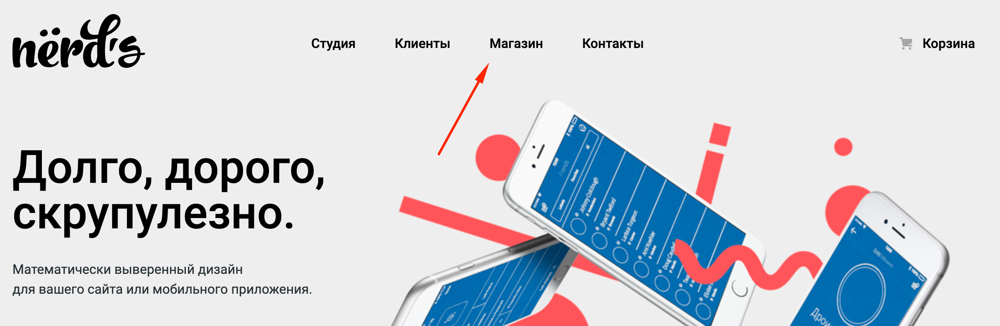
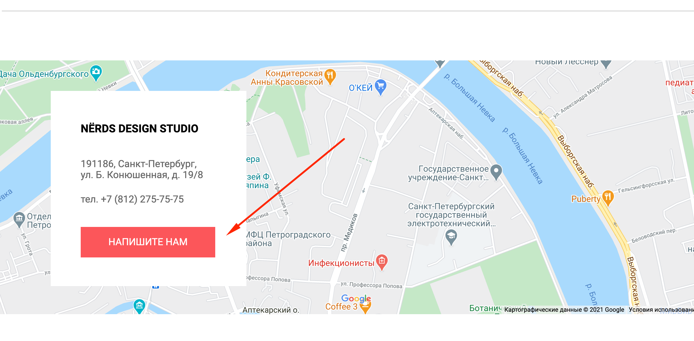

# site-nerds
https://boikoyv.github.io/site-nerds/.

## **Верстка учебного сайта из нескольких страниц:**

 - Главная;
 - Каталог.

## Детали верстки:

- С главной страници можно перейти на страницу "Магазин". Описание карточек в каталоге появляются при наведении

- В футере интерактивная гугл карта и при нажатии на кнопку "Напишите нам", появляетя всплывающее модальное окно с фомрой обратной связи. Форма оживлена на JS , реагирует на незаполненные поля ввода. Также присутствует CSS анимация.

